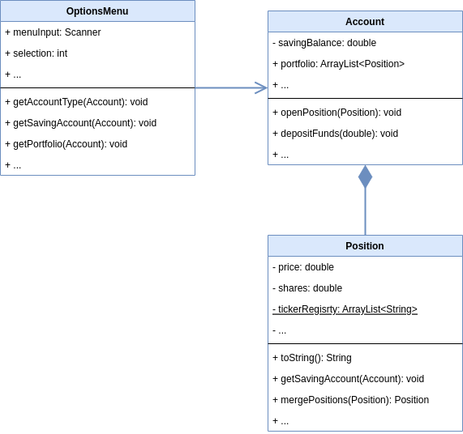

# simple-portfolio

> This project is part of my software architecture journey. See my [software-architecture-journey](https://github.com/mykingdomforapawn/software-architecture-journey) repository for more details.

This simple project lets the user interact with an application in the terminal to set up and play around with a combination of a savings account and a stock portfolio. 

---

## Table of contents:
- [Why? - How? - What?](#why---how---what)
- [Class diagram](#class-diagram)

---

## Why? - How? - What?

Having worked with other programming languages, I needed a small and comprehensive project to get into Java. This application does not serve any specific purpose other than letting me try out some concepts of the programming language. I started by watching some videos explaining the basics of Java and then just started from there with a learning-by-doing mindset. Whatever concept I stumbled across, I tried to implement the simplest version of it. This project covers: 

- Variables, constants, types, etc.
- Classes, objects, fields, methods, etc.
- Control statements
- Java project setup in IntelliJ
- User interaction with application running in terminal
- UML class diagrams

## Class diagram

